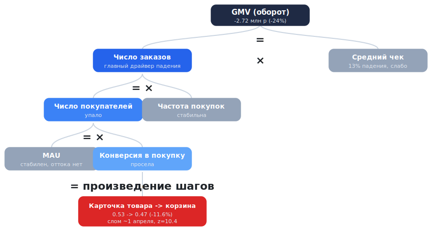

# Продуктовое исследование падения оборота сервиса доставки

Итоговый проект по продуктовой аналитике, Т-академия. В сервисе доставки продуктов из магазинов в последнем месяце начал снижаться оборот (GMV). Задача - провести исследование и точно установить, **что именно** стало причиной падения ключевой бизнес-метрики, подтвердив каждый вывод расчётами, графиками и статистическими тестами.

Весь анализ - в одном ноутбуке: [`gmv_drop_analysis.ipynb`](gmv_drop_analysis.ipynb).

## Данные

Данные за 6 месяцев (ноябрь 2025 - апрель 2026) в трёх таблицах:

- **`orders`** - заказы: суммы (GMV, скидки, сборы, итоговая оплата), город, платформа, способ оплаты, привязка к маркетинговой кампании и экспериментальной группе.
- **`funnel`** - пользовательские сессии и прохождение воронки: поиск товара -> просмотр карточки -> добавление в корзину -> переход в корзину -> покупка, с временными метками каждого шага.
- **`marketing_communications`** - маркетинговые коммуникации: тип, время отправки, кампания, тестовая/контрольная группа.

## Логика исследования

Для локализации проблемы была применена методика декомпозиции метрики: оборот последовательно раскладывается на множители, и на каждом шаге определяется, какой именно фактор просел.

### 1. EDA и проверка корректности данных

- Проверка размеров таблиц, типов, пропусков;
- Проверка уникальности и согласованности ключей между таблицами;
- Контроль полноты данных в конце периода, выявление недельной сезонности;
- Анализ выбросов GMV: показано, что падение системное, а не за счёт ухода крупных заказов.

### 2. Исследование причины падения

В данном блоке выполнена последовательная декомпозиция GMV.



Падение происходит на шаге воронки "карточка товара -> корзина".

### 3. Выводы и рекомендации

Сведение результатов: что произошло, каков характер падения, какие действия предпринять.

## Ключевые результаты

- Оборот в апреле упал на **2.72 млн р (-24%)** относительно марта;
- Декомпозиция падения по факторам: конверсия в покупку - 58% падения (главный и аномальный драйвер), число сессий - 29% (в основном календарный эффект, отток аудитории минимален), средний чек - 13%;
- MAU стабилен, проблема в конверсии;
- Конверсия «карточка товара -> корзина» обрушилась скачком около 1 апреля (примерно с 0.53 до 0.47, -11.6%) и осталась на новом уровне; падение значимо (z = 10.4, p ≈ 4e-25) и видно во всех сегментах и на всех платформах;
- Вероятная причина - техническое/продуктовое изменение в механике добавления товара в корзину, выкаченное около 1 апреля;
- Рекомендации: найти и откатить/исправить релиз на шаге добавления в корзину; настроить пошаговый мониторинг воронки (слом длился месяц, прежде чем был замечен по обороту). Восстановление конверсии возвращает ≈1.6 млн р оборота в месяц.

## Стек

Python: `pandas`, `numpy`, `matplotlib`, `seaborn`, `statsmodels` (z-тест пропорций).

## Как запустить локально

```bash
git clone https://github.com/RomanFyo/grocery-gmv-drop-analysis.git
cd <grocery-gmv-drop-analysis>
jupyter notebook gmv_drop_analysis.ipynb
```
